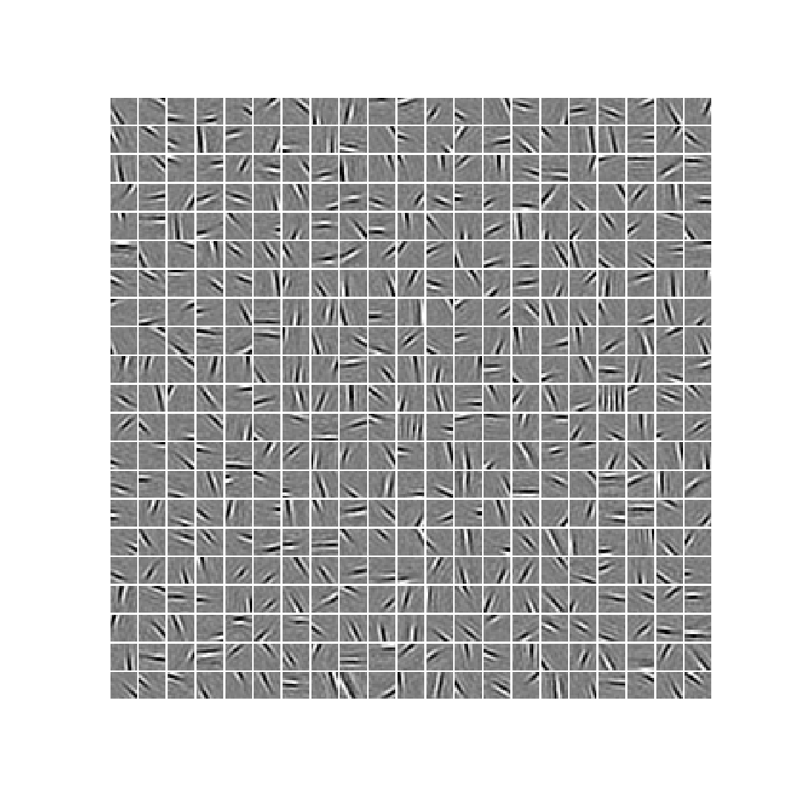

Reproducible research : Python implementation of SparseHebbianLearning
======================================================================

Object
------

* This is a collection of python scripts to test learning strategies to efficiently code natural image patches.  This is here restricted  to the framework of the SparseNet algorithm from Bruno Olshausen (http://redwood.berkeley.edu/bruno/sparsenet/).

* this has been published as Perrinet, Neural Computation (2010) (see  http://invibe.net/LaurentPerrinet/Publications/Perrinet10shl )::

   @article{Perrinet10shl,
        Author = {Perrinet, Laurent U.},
        Title = {Role of homeostasis in learning sparse representations},
        Year = {2010}
        Url = {http://invibe.net/LaurentPerrinet/Publications/Perrinet10shl},
        Doi = {10.1162/neco.2010.05-08-795},
        Journal = {Neural Computation},
        Volume = {22},
        Number = {7},
        Keywords = {Neural population coding, Unsupervised learning, Statistics of natural images, Simple cell receptive fields, Sparse Hebbian Learning, Adaptive Matching Pursuit, Cooperative Homeostasis, Competition-Optimized Matching Pursuit},
        Month = {July},
        }

* all comments and bug corrections should be submitted to Laurent Perrinet at Laurent.Perrinet@univ-amu.fr
* find out updates on http://invibe.net/LaurentPerrinet/SparseHebbianLearning

Installation
-------------

* Be sure to have dependencies installed::

   pip3 install -U SLIP

* Then, either install the code directly::

   pip3 install git+https://github.com/bicv/SparseHebbianLearning.git

* or if you wish to tinker with the code, download the code @ https://github.com/bicv/SparseHebbianLearning//archive/master.zip. You may also grab it directly using the command-line::

   wget https://github.com/bicv/SparseHebbianLearning//archive/master.zip
   unzip master.zip -d SparseHebbianLearning/
   cd SparseHebbianLearning/
   ipython setup.py clean build install
   jupyter notebook

* developpers may use all the power of git with::

   git clone https://github.com/bicv/SparseHebbianLearning.git

Licence
--------

This piece of code is distributed under the terms of the GNU General Public License (GPL), check http://www.gnu.org/copyleft/gpl.html if you have not red the term of the license yet.

Contents
--------

* ``README.rst`` : this file
* ``index.ipynb`` : an introduction as a notebook
* ``src/shl_*.py`` : the class files
* ``probe*.ipynb`` : the individual experiments as notebooks
* ``database`` : the image files.

Changelog
---------

* 3.0 - 2017-06-06: refactored the code for http://invibe.net/LaurentPerrinet/Publications/BoutinRuffierPerrinet17spars

* 2.1 - 2015-10-20:
 * finalizing the code to reproduce the sparsenet algorithm

* 2.0 - 2015-05-07:
 * transform to a class to just do the Sparse Hebbian Learning (high-level) experiments (getting data from an image folder, learning, coding, analyszing)
 * use sklearn to do all the hard low-level work, in particular ``sklearn.decomposition.SparseCoder`` see http://scikit-learn.org/stable/auto_examples/decomposition/plot_image_denoising.html and http://www.cs.utexas.edu/~leif/pubs/20130626-scipy-johnson.pdf
 * The dictionary learning is tested in http://blog.invibe.net/posts/2015-05-05-reproducing-olshausens-classical-sparsenet.html and the corresponding PR is tested in http://blog.invibe.net/posts/2015-05-06-reproducing-olshausens-classical-sparsenet-part-2.html

* 1.1 - 2014-06-18:
 * documentation
 * dropped Matlab support

* 1.0 - 2011-10-27 : initial release
